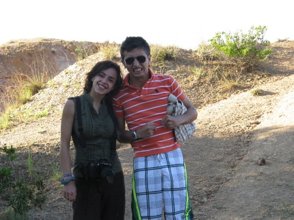
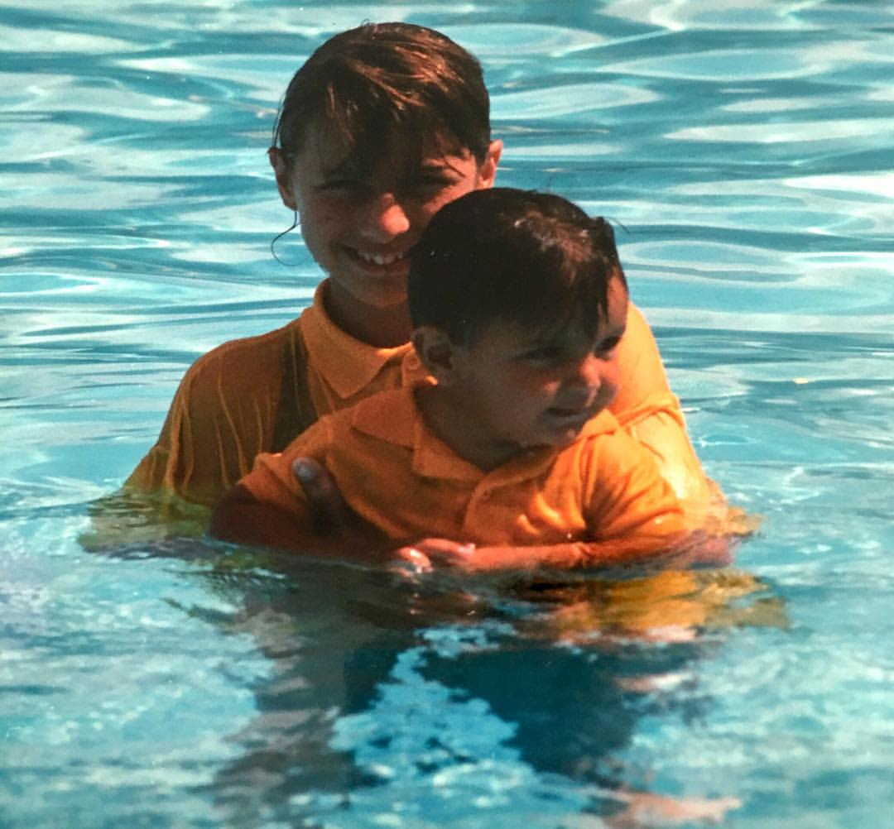
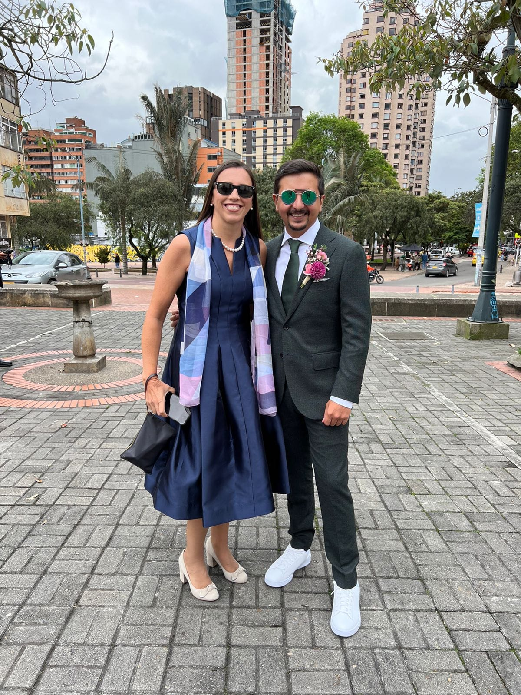
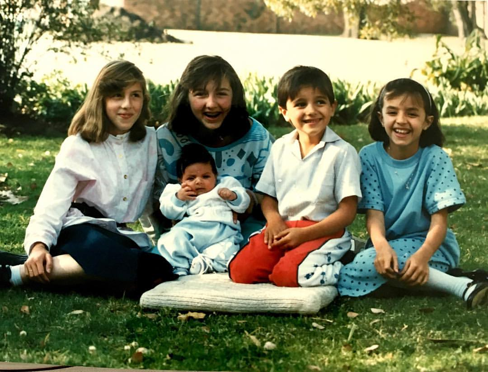

class: inverse, middle

```{r Setup, include = F}
options(htmltools.dir.version = FALSE)
library(pacman)
p_load(broom, latex2exp, ggplot2, ggthemes, viridis, dplyr, magrittr, knitr, parallel)
# Define pink color
red_pink <- "#e64173"
# Knitr options
opts_chunk$set(
  comment = "#>",
  fig.align = "center",
  fig.height = 7,
  fig.width = 10.5,
  # dpi = 300,
  warning = F,
  message = F
)
# A blank theme for ggplot
theme_empty <- theme_bw() + theme(
  line = element_blank(),
  rect = element_blank(),
  strip.text = element_blank(),
  axis.text = element_blank(),
  plot.title = element_blank(),
  axis.title = element_blank(),
  plot.margin = structure(c(0, 0, -1, -1), unit = "lines", valid.unit = 3L, class = "unit"),
  legend.position = "none"
)
theme_simple <- theme_bw() + theme(
  line = element_blank(),
  panel.grid = element_blank(),
  rect = element_blank(),
  strip.text = element_blank(),
  axis.text.x = element_text(size = 14),
  axis.text.y = element_blank(),
  axis.ticks = element_blank(),
  plot.title = element_blank(),
  axis.title = element_blank(),
  # plot.margin = structure(c(0, 0, -1, -1), unit = "lines", valid.unit = 3L, class = "unit"),
  legend.position = "none"
)

```

```{css, echo = F}
@media print {
  .has-continuation {
    display: block !important;
  }
}
<style type="text/css">
.remark-slide-content {
    font-size: 30px;
    padding: 1em 4em 1em 4em;
}
</style>
.my-one-page-font {
  font-size: 40px;
}
```

# Outliers: Una Breve Introducción


---
class: white-slide


<center>

</center>

---

class: left

# ¿Qué es un Outlier?

Un **outlier** o .hi[valor atípico] es una observación que se diferencia .mono[significativamente] de otras observaciones en un conjunto de datos.

## Características Clave

1. **Distancia de la norma**: Notablemente diferente de otras observaciones.
2. **Identificación**: Se pueden identificar mediante técnicas estadísticas.
3. **Impacto en el análisis**: Pueden afectar significativamente los resultados.
4. **No siempre son errores**: Pueden ser variaciones reales y significativas.
5. **Tratamiento de outliers**: Depende del contexto y objetivo del análisis.

---
layout: true

# ¿Por qué son importantes?


---

--

```{R, gen dataset, include = F, cache = T}
# Set population and sample sizes
n_p <- 100
n_s <- 30
# Set the seed
set.seed(12468)
# Generate data
pop_df <- tibble(
  i = 3,
  x = rnorm(n_p, mean = 5, sd = 1.5),
  e = rnorm(n_p, mean = 0, sd = 1),
  y = i + 0.5 * x + e,
  row = rep(1:sqrt(n_p), times = sqrt(n_p)),
  col = rep(1:sqrt(n_p), each = sqrt(n_p)),
  s1 = sample(x = c(rep(T, n_s), rep(F, n_p - n_s))),
  s2 = sample(x = c(rep(T, n_s), rep(F, n_p - n_s))),
  s3 = sample(x = c(rep(T, n_s), rep(F, n_p - n_s)))
)
pop_df <- pop_df %>%
  add_row(i = 3, x = 10, y = 22, row = sqrt(n_p) , col = sqrt(n_p) , s1 = F, s2 = F, s3 = F)
# Regressions
lm0 <- lm(y ~ x, data = pop_df)
lm1 <- lm(y ~ x, data = filter(pop_df, s1 == T))
lm2 <- lm(y ~ x, data = filter(pop_df, s2 == T))
lm3 <- lm(y ~ x, data = filter(pop_df, s3 == T))
# Simulation
set.seed(12468)
sim_df <- mclapply(mc.cores = 10, X = 1:1e4, FUN = function(x, size = n_s) {
  lm(y ~ x, data = pop_df %>% sample_n(size = size)) %>% tidy()
}) %>% do.call(rbind, .) %>% as_tibble()
pop_df <- pop_df %>%
  add_row(i = 3, x = 10, y = 22, row = sqrt(n_p) , col = sqrt(n_p), s1 = T, s2 = F, s3 = F)

```

.pull-left[

```{R, pop1, echo = F, fig.fullwidth = T, dev = "svg"}
ggplot(data = pop_df, aes(x = row, y = col)) +
geom_point(color = "darkslategray", size = 10) +
theme_empty

```

.center[**Población**]

]

--

.pull-right[

```{R, scatter1, echo = F, fig.fullwidth = T, dev = "svg"}
ggplot(data = pop_df, aes(x = x, y = y)) +
  geom_abline(
    intercept = lm0$coefficients[1], slope = lm0$coefficients[2],
    color = red_pink, size = 3
  ) +
  geom_point(aes(color = ifelse(x == 10 & y == 22, "orange", "darkslategray")), size = 8) +
  scale_color_identity() +
  theme_empty
```

.center[**Relación entre dos variables**]

$$ y_i = `r round(lm0$coefficients[1], 2)` + `r round(lm0$coefficients[2], 2)` x_i + u_i $$

$$ y_i = \beta_0 + \beta_1 x_i + u_i $$


]

---

.pull-left[

```{R, sample1, echo = F, fig.fullwidth = T, dev = "svg"}
ggplot(data = pop_df, aes(x = row, y = col, shape = s1)) +
  geom_point(aes(color = ifelse(row == 10 & col == 22, "orange", "darkslategray")), size = 10) +
  scale_shape_manual(values = c(1, 19)) +
  scale_color_identity() +
  theme_empty
```

.center[**Sample 1:** 30 random individuals]

]

--

.pull-right[

```{R, sample1 scatter, echo = F, fig.fullwidth = T, dev = "svg"}
ggplot(data = pop_df, aes(x = x, y = y)) +
  geom_abline(
    intercept = lm0$coefficients[1], slope = lm0$coefficients[2],
    color = red_pink, size = 3, alpha = 0.3
  ) +
  geom_point(aes(shape = s1, color = ifelse(x == 10 & y == 22, "orange", "darkslategray")), size = 8) +
  geom_abline(
    intercept = lm1$coefficients[1], slope = lm1$coefficients[2],
    size = 2, linetype = 2, color = "black"
  ) +
  scale_shape_manual(values = c(1, 19)) +
  scale_color_identity() +
  theme_empty
```

.center[

**Population relationship**
<br>
$y_i = `r round(lm0$coefficients[1], 2)` + `r round(lm0$coefficients[2], 2)` x_i + u_i$

**Sample relationship**
<br>
$\hat{y}_i = `r round(lm1$coefficients[1], 2)` + `r round(lm1$coefficients[2], 2)` x_i$

]

]

---
count: false

.pull-left[

```{R, sample2, echo = F, fig.fullwidth = T, dev = "svg"}
ggplot(data = pop_df, aes(x = row, y = col, shape = s2)) +
geom_point(color = "darkslategray", size = 10) +
scale_shape_manual(values = c(1, 19)) +
theme_empty
```

.center[**Sample 2:** 30 random individuals]

]

.pull-right[

```{R, sample2 scatter, echo = F, fig.fullwidth = T, dev = "svg"}
ggplot(data = pop_df, aes(x = x, y = y)) +
geom_abline(
  intercept = lm0$coefficients[1], slope = lm0$coefficients[2],
  color = red_pink, size = 3, alpha = 0.3
) +
geom_point(aes(shape = s2), color = "darkslategray", size = 6) +
geom_abline(
  intercept = lm1$coefficients[1], slope = lm1$coefficients[2],
  size = 2, linetype = 2, color = "black", alpha = 0.3
) +
geom_abline(
  intercept = lm2$coefficients[1], slope = lm2$coefficients[2],
  size = 2, linetype = 2, color = "black"
) +
scale_shape_manual(values = c(1, 19)) +
theme_empty
```

.center[

**Population relationship**
<br>
$y_i = `r round(lm0$coefficients[1], 2)` + `r round(lm0$coefficients[2], 2)` x_i + u_i$

**Sample relationship**
<br>
$\hat{y}_i = `r round(lm2$coefficients[1], 2)` + `r round(lm2$coefficients[2], 2)` x_i$

]

]
---
count: false

.pull-left[

```{R, sample3, echo = F, fig.fullwidth = T, dev = "svg"}
ggplot(data = pop_df, aes(x = row, y = col, shape = s3)) +
geom_point(color = "darkslategray", size = 10) +
scale_shape_manual(values = c(1, 19)) +
theme_empty
```

.center[**Sample 3:** 30 random individuals]

]

.pull-right[

```{R, sample3 scatter, echo = F, fig.fullwidth = T, dev = "svg"}
ggplot(data = pop_df, aes(x = x, y = y)) +
geom_abline(
  intercept = lm0$coefficients[1], slope = lm0$coefficients[2],
  color = red_pink, size = 3, alpha = 0.3
) +
geom_point(aes(shape = s3), color = "darkslategray", size = 6) +
geom_abline(
  intercept = lm1$coefficients[1], slope = lm1$coefficients[2],
  size = 2, linetype = 2, color = "black", alpha = 0.3
) +
geom_abline(
  intercept = lm2$coefficients[1], slope = lm2$coefficients[2],
  size = 2, linetype = 2, color = "black", alpha = 0.3
) +
geom_abline(
  intercept = lm3$coefficients[1], slope = lm3$coefficients[2],
  size = 2, linetype = 2, color = "black"
) +
scale_shape_manual(values = c(1, 19)) +
theme_empty
```

.center[

**Population relationship**
<br>
$y_i = `r round(lm0$coefficients[1], 2)` + `r round(lm0$coefficients[2], 2)` x_i + u_i$

**Sample relationship**
<br>
$\hat{y}_i = `r round(lm3$coefficients[1], 2)` + `r round(lm3$coefficients[2], 2)` x_i$

]

]


---
layout: false
#Ejemplo 

<center>

</center>

---
class: inverse, center, middle

# 1. **Distancia de la norma**: Notablemente diferente de otras observaciones.


---
#Distribución del malgenio de la familia


```{R, variance pdf, echo = F, dev = "svg", fig.height = 7}
# Generate a log-normal distribution (which is right-skewed)
library(grid)
library(jpeg)
right_skewed_data <- rlnorm(1000, meanlog = 0, sdlog = 1)

# Create a left-skewed distribution by subtracting from a constant
constant <- max(right_skewed_data) + 1
left_skewed_data <- constant - right_skewed_data
img <- readJPEG("dfd1.jpg")
g <- rasterGrob(img, interpolate=TRUE)
img <- readJPEG("dfd2.jpg")
g2 <- rasterGrob(img, interpolate=TRUE)
# Create a tibble for ggplot
d5 <- tibble(x = left_skewed_data)
# Crear el gráfico
ggplot(d5, aes(x = x)) +
  geom_density(aes(y = ..count..), fill = "darkslategray", color = "black", alpha = 0.9) +
  geom_vline(xintercept = 0.5, size = 1, linetype = "dashed") +
  geom_text(aes(x = 0.5, y = 100, label = "DIEGO F. DIAZ"), hjust = -0.3, vjust = -2.5, color = "orange") +
  annotation_custom(g, xmin = -1, xmax = 4 , ymin = 10 , ymax = 100) +
annotation_custom(g2, xmin = 17, xmax = 20 , ymin = 480 , ymax = 550) +
  scale_y_continuous(breaks = c(0, 150, 300, 450, 550), labels = c("Nadie", "Pocos", "Algunos", "Casi todos", "Toditos")) +
  scale_x_continuous(breaks = c(0, 5, 10, 15, 18), labels = c("Zen", "Baja", "Soportable", "Inmamable", "Energúmeno")) +
  theme_minimal() +
  theme(axis.text.x = element_text(size = 16)) +
  xlab("Mal Genio de la Familia Diaz Escobar") +
  ylab("Personas") 
```

---
# ¿Diego es un?

--

<center>

</center>

---

#Palabras empleadas al hablar


```{R, fig2 pdf, echo = F, dev = "svg", fig.height = 7}
# Generate a log-normal distribution (which is right-skewed)
library(grid)
library(jpeg)
right_skewed_data <- rlnorm(1500, meanlog = 0, sdlog = 1)

# Create a left-skewed distribution by subtracting from a constant
constant <- max(right_skewed_data) + 1
left_skewed_data <- constant - right_skewed_data
img <- readJPEG("dfd1.jpg")
g <- rasterGrob(img, interpolate=TRUE)
img <- readJPEG("dfd3.jpg")
g2 <- rasterGrob(img, interpolate=TRUE)
img <- readJPEG("led1.jpg")
g3 <- rasterGrob(img, interpolate=TRUE)
# Create a tibble for ggplot
d5 <- tibble(x = left_skewed_data)
# Crear el gráfico
ggplot(d5, aes(x = x)) +
  geom_density(aes(y = ..count..), fill = red_pink, color = "black", alpha = 0.9) +
  geom_vline(xintercept = 0.5, size = 1, linetype = "dashed") +
  geom_text(aes(x = 0.5, y = 100, label = "DIEGO F. DIAZ"), hjust = -0.3, vjust = -2.5, color = "orange") +
  annotation_custom(g, xmin = -1, xmax = 4 , ymin = 10 , ymax = 100) +
  annotation_custom(g3, xmin = 14, xmax = 17 , ymin = 10 , ymax = 100) +
annotation_custom(g2, xmin = 25, xmax = 27 , ymin = 780 , ymax = 850) +
  scale_y_continuous(breaks = c(0, 200, 400, 600, 800), labels = c("Nadie", "Pocos", "Algunos", "Casi todos", "Toditos")) +
  scale_x_continuous(breaks = c(0, 5, 10, 15, 20, 25), labels = c("Señas", "5", "10", "15", "20", "1500")) +
  theme_minimal() +
  theme(axis.text.x = element_text(size = 16)) +
  xlab("Palabras empleadas para expresar una idea") +
  ylab("Personas") 
```

---
# ¿Diego es un?

--

<center>

</center>

---

#Disponbilidad 


```{R, fig3 pdf, echo = F, dev = "svg", fig.height = 7}
# Generate a log-normal distribution (which is right-skewed)
library(grid)
library(jpeg)
right_skewed_data <- rlnorm(1500, meanlog = 0, sdlog = 1)

# Create a left-skewed distribution by subtracting from a constant
constant <- max(right_skewed_data) + 1
left_skewed_data <- constant - right_skewed_data
img <- readJPEG("dfd1.jpg")
g <- rasterGrob(img, interpolate=TRUE)
img <- readJPEG("dfd2.jpg")
g2 <- rasterGrob(img, interpolate=TRUE)
# Create a tibble for ggplot
d5 <- tibble(x = left_skewed_data)
# Crear el gráfico
ggplot(d5, aes(x = x)) +
  geom_density(aes(y = ..count..), fill = "darkgreen", color = "black", alpha = 0.9) +
  geom_vline(xintercept = 0.5, size = 1, linetype = "dashed") +
  annotation_custom(g2, xmin = -1, xmax = 4 , ymin = 10 , ymax = 100) +
annotation_custom(g, xmin = 19, xmax = 22 , ymin = 750 , ymax = 850) +
  scale_y_continuous(breaks = c(0, 200, 400, 600, 800), labels = c("Nadie", "Pocos", "Algunos", "Casi todos", "Toditos")) +
  scale_x_continuous(breaks = c(0, 5, 10, 15, 17.5, 20), labels = c("Ayudo en algo ", "", "", "", "", "Siempre Listo")) +
  theme_minimal() +
  theme(axis.text.x = element_text(size = 16)) +
  xlab("Disponibilidad para ayudar/acompañar/escuchar/cocinar/....") +
  ylab("Personas") 
```

---
# ¿Diego es un?

--

<center>

</center>

---

# Buen gusto musical


```{R, fig4 pdf, echo = F, dev = "svg", fig.height = 7}
# Generate a log-normal distribution (which is right-skewed)
library(grid)
library(jpeg)
right_skewed_data <- rlnorm(1000, meanlog = 0, sdlog = 1)

# Create a left-skewed distribution by subtracting from a constant
constant <- max(right_skewed_data) + 1
left_skewed_data <- constant - right_skewed_data
img <- readJPEG("dfd1.jpg")
g <- rasterGrob(img, interpolate=TRUE)
img <- readJPEG("dfd2.jpg")
g2 <- rasterGrob(img, interpolate=TRUE)
# Create a tibble for ggplot
d5 <- tibble(x = left_skewed_data)
# Crear el gráfico
ggplot(d5, aes(x = x)) +
  geom_density(aes(y = ..count..), fill = "darkred", color = "black", alpha = 0.9) +
  geom_vline(xintercept = 0.5, size = 1, linetype = "dashed") +
  geom_text(aes(x = 0.5, y = 100, label = "DIEGO F. DIAZ"), hjust = -0.3, vjust = -2.5, color = "orange") +
  annotation_custom(g, xmin = -1, xmax = 4 , ymin = 10 , ymax = 100) +
annotation_custom(g2, xmin = 39, xmax = 41 , ymin = 480 , ymax = 550) +
  scale_y_continuous(breaks = c(0, 150, 300, 450, 550), labels = c("Nadie", "Pocos", "Algunos", "Casi todos", "Toditos")) +
  scale_x_continuous(breaks = c(0, 10, 20, 30, 40), labels = c("METAL DEL DEMONIO", "Regueton", "Tropipop", "Merengue", "Musica")) +
  theme_minimal() +
  theme(axis.text.x = element_text(size = 16)) +
  xlab("") +
  ylab("Personas") 
```

---
# ¿Diego es un?

--

<center>

</center>

---

#Ya obtuvo parte de la herencia 


```{R, fig5 pdf, echo = F, dev = "svg", fig.height = 7}
# Generate a log-normal distribution (which is right-skewed)
library(grid)
library(jpeg)
right_skewed_data <- rlnorm(1000, meanlog = 0, sdlog = 1)

# Create a left-skewed distribution by subtracting from a constant
constant <- max(right_skewed_data) + 1
left_skewed_data <- constant - right_skewed_data
img <- readJPEG("dfd1.jpg")
g <- rasterGrob(img, interpolate=TRUE)
img <- readJPEG("dfd4.jpg")
g2 <- rasterGrob(img, interpolate=TRUE)
# Create a tibble for ggplot
d5 <- tibble(x = left_skewed_data)
# Crear el gráfico
ggplot(d5, aes(x = x)) +
  geom_density(aes(y = ..count..), fill = "darkblue", color = "black", alpha = 0.9) +
  geom_vline(xintercept = 0.5, size = 1, linetype = "dashed") +
  geom_text(aes(x = 0.5, y = 100, label = "Hermanos"), hjust = -0.3, vjust = -2.5, color = "orange") +
  annotation_custom(g2, xmin = -1, xmax = 4 , ymin = 10 , ymax = 100) +
annotation_custom(g, xmin = 23, xmax = 25 , ymin = 480 , ymax = 550) +
  scale_y_continuous(breaks = c(0, 150, 300, 450, 550), labels = c("Nadie", "Pocos", "Algunos", "Casi todos", "Toditos")) +
  scale_x_continuous(breaks = c(0, 5, 10, 15, 20, 22), labels = c("Educación", "Mimos", "Inversiones", "Lonchera Semanal", "",  "Todo + 1/2 CARRO")) +
  theme_minimal() +
  theme(axis.text.x = element_text(size = 16)) +
  xlab("Ya recibió") +
  ylab("Personas") 
```

---
# ¿Diego es un?

--

<center>

</center>

---

#Amor absoluto y exclusivo de su madre 


```{R, fig6 pdf, echo = F, dev = "svg", fig.height = 7}
# Generate a log-normal distribution (which is right-skewed)
library(grid)
library(jpeg)
right_skewed_data <- rlnorm(1000, meanlog = 0, sdlog = 1)

# Create a left-skewed distribution by subtracting from a constant
constant <- max(right_skewed_data) + 1
left_skewed_data <- constant - right_skewed_data
img <- readJPEG("dfd1.jpg")
g <- rasterGrob(img, interpolate=TRUE)
img <- readJPEG("dfd4.jpg")
g2 <- rasterGrob(img, interpolate=TRUE)
# Create a tibble for ggplot
d5 <- tibble(x = left_skewed_data)
# Crear el gráfico
ggplot(d5, aes(x = x)) +
  geom_density(aes(y = ..count..), fill = red_pink , color = "black", alpha = 0.7) +
  geom_vline(xintercept = 0.5, size = 1, linetype = "dashed") +
  geom_text(aes(x = 0.5, y = 100, label = "Hermanos"), hjust = -0.3, vjust = -2.5, color = "orange") +
  annotation_custom(g2, xmin = -1, xmax = 4 , ymin = 10 , ymax = 100) +
annotation_custom(g, xmin = 17, xmax = 19 , ymin = 480 , ymax = 550) +
  scale_y_continuous(breaks = c(0, 150, 300, 450, 550), labels = c("Nadie", "Pocos", "Algunos", "Casi todos", "Toditos")) +
  scale_x_continuous(breaks = c(0, 5, 10, 17), labels = c("No es que los odie", "", "",  "Adoración absoluta")) +
  theme_minimal() +
  theme(axis.text.x = element_text(size = 16)) +
  xlab("Amor Maternal") +
  ylab("Personas") 
```

---
# ¿Diego es un?

--

<center>

</center>

---

#Cantidad de matemáticas que estudió en el pregrado


```{R, fig7 pdf, echo = F, dev = "svg", fig.height = 7}
# Generate a log-normal distribution (which is right-skewed)
library(grid)
library(jpeg)
right_skewed_data <- rlnorm(1000, meanlog = 0, sdlog = 1)

# Create a left-skewed distribution by subtracting from a constant
constant <- max(right_skewed_data) + 1
left_skewed_data <- constant - right_skewed_data
img <- readJPEG("dfd1.jpg")
g <- rasterGrob(img, interpolate=TRUE)
img <- readJPEG("dfd2.jpg")
g2 <- rasterGrob(img, interpolate=TRUE)
# Create a tibble for ggplot
d5 <- tibble(x = left_skewed_data)
# Crear el gráfico
ggplot(d5, aes(x = x)) +
  geom_density(aes(y = ..count..), fill = "darkred", color = "black", alpha = 0.7) +
  geom_vline(xintercept = 0.5, size = 1, linetype = "dashed") +
  geom_text(aes(x = 0.5, y = 100, label = "DIEGO F. DIAZ"), hjust = -0.3, vjust = -2.5, color = "orange") +
  annotation_custom(g, xmin = -1, xmax = 4 , ymin = 10 , ymax = 100) +
annotation_custom(g2, xmin = 12, xmax = 14 , ymin = 480 , ymax = 550) +
  scale_y_continuous(breaks = c(0, 150, 300, 450, 550), labels = c("Nadie", "Pocos", "Algunos", "Casi todos", "Toditos")) +
  scale_x_continuous(breaks = c(0,3, 6, 9, 13), labels = c("Sé Sumar y Restar ", "Algebra", "Calculo", "Estadística", "Análisis Real")) +
  theme_minimal() +
  theme(axis.text.x = element_text(size = 16)) +
  xlab("") +
  ylab("Personas") 
```

---
# ¿Diego es un?

--

<center>

</center>

---
# Otros ejemplos


---

class: inverse, center, middle

# 2. **Causas**: es importante identificar qué generó este comportamiento.

---
#Posibles causas

1. .hi[Factores biólogicos]
2. Experiencia, madurez y .hi[vejez] de los padres
3. .hi[Choques Externos]
4. .hi[Interacciones] con los hermanos y .hi[ambiente] en el que creció

---
#1. Factores biológicos
Cambios en el ambiente del útero o el sistema inmunológico materno que ocurren a lo largo de nacimientos sucesivos.

```{R, fig8 pdf, echo = F, dev = "svg", fig.height = 6}
set.seed(123)  # for reproducibility
data <- tibble(x = rnorm(1000, mean = 30, sd = 5))

# Calculate the density
density_data <- density(data$x)

# Convert the density object to a data frame
density_df <- tibble(x = density_data$x, y = density_data$y)

# Create the plot
ggplot(density_df, aes(x = x, y = y)) +
  geom_line() +
  geom_vline(xintercept = 40, color = "red", linetype = "dashed") +
  geom_ribbon(data = subset(density_df, x > 40), aes(ymin = 0, ymax = y), fill = "red", alpha = 0.5) +
  geom_ribbon(data = subset(density_df, x < 40), aes(ymin = 0, ymax = y), fill = "gray", alpha = 0.5) +
  annotate("text", x = 45, y = 0.003, label = "Discapacidad cognitiva severa", color = "black") +
  scale_x_continuous(breaks = c(0,10, 26, 28, 32, 33, 39, 40)) +
  theme_minimal() +
  ylab("Inteligencia") +
  xlab("Edad de la Madre")
```
--
Se salvó por .hi[15 días]
---
#2. .hi[Vejez] de los padres
| Nombre | Edad de la Madre | Edad del Padre |
|--------|------------------|----------------|
| Pato   | 26               | 29             |
| Lili   | 28               | 31             |
| Nita   | 32               | 35             |
| Juan   | 33               | 39             |
| Diego  | 39               | 42             |
---
#2. .hi[Vejez] de los padres
| Nombre | Edad de la Madre | Edad del Padre |
|--------|------------------|----------------|
| Pato   | 26               | 29             |
| Lili   | 28               | 31             |
| Nita   | 32               | 35             |
| Juan   | 33               | 39             |
| Diego  | 39 / 13 / 11              | 42             |

--
La podemos descartar
---

#3. Choques Externos


---
#3. Choques Externos


---

#4. Ambiente en el que creció



---

class: inverse, center, middle

# **Conclusión**

---
# Conclusion

Diego es un OUTLIER por culpa de .hi[LILI]

--


---
#Bono1: Nació siendo un OUTLIER

---
#Bono2: 

<audio controls>
  <source src="regueton.mp3" type="audio/mpeg">
  Your browser does not support the audio element.
</audio>

<audio controls>
  <source src="ñerada.mp3" type="audio/mpeg">
  Your browser does not support the audio element.
</audio>

---

exclude: true

```{R, print pdfs, echo = F, eval = F}
pagedown::chrome_print(
  input = "02-review.html",
  timeout = 60
)
```
